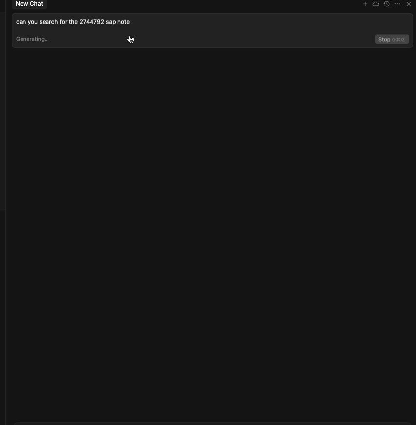

# SAP Note Search MCP Server

> **MCP server for searching SAP Notes/KB articles using SAP Passport authentication and Playwright automation**

[](https://opensource.org/licenses/Apache-2.0)
[](https://nodejs.org/)
[](https://www.typescriptlang.org/)

This Model Context Protocol (MCP) server provides direct access to SAP Notes and Knowledge Base articles through Cursor AI. It uses SAP Passport certificate authentication and Playwright browser automation to retrieve actual note content from SAP's systems.

## ✨ Features

- 🔍 **Direct SAP Note access** - Retrieve full note content and metadata
- 🎫 **SAP Passport authentication** - Secure certificate-based authentication
- 🤖 **Playwright automation** - Handles complex SAP authentication flows
- 💾 **Smart caching** - Authentication tokens cached locally
- 🔧 **Debug-friendly** - Comprehensive logging and troubleshooting options
- 📋 **MCP compliant** - Works seamlessly with Cursor AI

## Live Preview in Cursor




## 🚀 Quick Start

### Prerequisites

- **Node.js 18+** - [Download here](https://nodejs.org/)
- **SAP Passport Certificate** - Your personal .pfx certificate file
- **Cursor AI** - [Download here](https://cursor.sh/)

### Installation

1. **Clone the repository**
   ```bash
   git clone https://github.com/marianfoo/mcp-sap-notes
   cd mcp-sap-notes
   ```

2. **Install dependencies**
   ```bash
   npm install
   ```

3. **Build the project**
   ```bash
   npm run build
   ```

### Setup

1. **Get your SAP Passport certificate - Only possible for S-User**
   - Go to [SAP Passport](https://support.sap.com/en/my-support/single-sign-on-passports.html)
   - Create your certificate
   - Download the .pfx certificate file


2. **Create certificate directory**
   - macOS/Linux:
     ```bash
     mkdir certs
     ```
   - Windows (PowerShell):
     ```powershell
     New-Item -ItemType Directory -Force -Path certs | Out-Null
     ```

3. **Copy your SAP Passport certificate**
   - Place your `.pfx` certificate file in the `certs/` directory
   - Name it `sap.pfx` (or update the path in configuration)

4. **Configure environment**
   - macOS/Linux:
     ```bash
     cp .env.example .env
     ```
   - Windows (PowerShell):
     ```powershell
     Copy-Item .env.example .env
     ```
   
   Edit `.env` and add your certificate passphrase:
   ```env
   PFX_PATH=./certs/sap.pfx
   PFX_PASSPHRASE=your_actual_passphrase
   ```

### Connect to Cursor

1. **Open Cursor settings** (`Cmd/Ctrl + ,`)

2. **Add MCP server configuration** to your `settings.json`:
   ```json
   {
     "mcpServers": {
       "sap-note-search": {
         "command": "node",
         "args": ["/full/path/to/sap-note-search-mcp/dist/mcp-server.js"]
       }
     }
   }
   ```

   **⚠️ Important:** Replace the project path with your actual absolute path.
   - On Windows, use a full path like `C:\\Users\\you\\mcp-sap-notes\\dist\\mcp-server.js`.
   - On macOS/Linux, use a path like `/Users/you/mcp-sap-notes/dist/mcp-server.js`.

3. **Restart Cursor** - The SAP Note tools will appear in your AI assistant

## 🎯 Usage Examples

### Search for a specific SAP Note
```
Find SAP Note 2744792
```

### Search by keywords
```
Search for SAP Notes about "OData gateway metadata error"
```

### Get complete note details
```
Get the full content of SAP Note 2744792
```

## 🛠️ Testing & Development

### Test Authentication
```bash
npm run test:auth
```
This tests the SAP Passport authentication flow and verifies your certificate setup.

### Test API Access
```bash
npm run test:api
```
This tests the SAP Notes API integration and content extraction.

### Test Complete MCP Server
```bash
npm run test:mcp
```
This simulates the complete MCP server workflow.

### Run All Tests
```bash
npm run test
```

## 🐛 Troubleshooting

### Certificate Issues

**Error: "Certificate file not found"**
- Ensure the certificate path in your configuration is correct
- Use full absolute paths in Cursor's `settings.json`
- Verify the certificate file exists and is readable

**Error: "Authentication failed"**
- Check your certificate passphrase is correct
- Ensure your SAP Passport certificate is valid and not expired
- Try running with `HEADFUL=true` to see browser authentication

### Browser Issues

**Error: "Browser launch failed"**
```bash
# Install Playwright browsers
npx playwright install
```

**Authentication hangs or times out**
- Run with debug mode: `HEADFUL=true npm run test:auth`
- Check your network connection to SAP systems
- Verify your certificate has proper SAP system access

### MCP Integration Issues

**Tools not appearing in Cursor**
- Restart Cursor completely
- Check the MCP server path in `settings.json` is absolute
- Verify the `cwd` setting points to your project directory

**Error: "MCP server failed to start"**
- Check the console output in Cursor's developer tools
- Ensure all dependencies are installed: `npm install`
- Verify the build completed successfully: `npm run build`

### Debug Mode

Enable debug mode for detailed troubleshooting:

```bash
# macOS/Linux
export HEADFUL=true
export LOG_LEVEL=debug
npm run test:auth

# Windows (PowerShell)
$env:HEADFUL = 'true'
$env:LOG_LEVEL = 'debug'
npm run test:auth
```

## 📁 Project Structure

```
sap-note-search-mcp/
├── src/
│   ├── mcp-server.ts        # Main MCP server
│   ├── auth.ts              # SAP authentication
│   ├── sap-notes-api.ts     # SAP Notes API client
│   ├── types.ts             # TypeScript definitions
│   └── logger.ts            # Logging configuration
├── test/
│   ├── test-auth.js         # Authentication tests
│   ├── test-sap-api.js      # API tests
│   └── test-mcp-server.js   # Complete server tests
├── dist/                    # Compiled JavaScript
├── certs/                   # Certificate directory
├── .env.example             # Environment template
└── README.md               # This file
```

## ⚙️ Configuration

### Environment Variables

| Variable | Required | Default | Description |
|----------|----------|---------|-------------|
| `PFX_PATH` | ✅ | - | Path to SAP Passport certificate (.pfx) |
| `PFX_PASSPHRASE` | ✅ | - | Certificate passphrase |
| `MAX_JWT_AGE_H` | ❌ | `12` | Token cache lifetime (hours) |
| `HEADFUL` | ❌ | `false` | Browser visibility (for debugging) |
| `LOG_LEVEL` | ❌ | `info` | Logging level (debug, info, warn, error) |

### Playwright Configuration

The server automatically installs required Playwright dependencies. For manual installation:

```bash
npx playwright install chromium
```

## 🔒 Security

- **Certificate Security**: Your SAP Passport certificate never leaves your machine
- **Token Caching**: Authentication tokens are cached locally and expire automatically
- **No Data Storage**: SAP Note content is retrieved on-demand, not stored
- **Secure Communication**: All SAP API calls use HTTPS with certificate authentication

## 📋 Available Tools

### `sap_note_search`
Search SAP Notes and KB articles by note ID or keywords.

**Parameters:**
- `q` (string, required): Query string or Note ID
- `lang` (string, optional): Language code ("EN" or "DE"), defaults to "EN"

### `sap_note_get`
Retrieve full content and metadata for a specific SAP Note.

**Parameters:**
- `id` (string, required): SAP Note ID (6-8 digits)
- `lang` (string, optional): Language code ("EN" or "DE"), defaults to "EN"

## 🤝 Contributing

1. Fork the repository
2. Create a feature branch: `git checkout -b feature/amazing-feature`
3. Commit your changes: `git commit -m 'Add amazing feature'`
4. Push to the branch: `git push origin feature/amazing-feature`
5. Open a Pull Request
